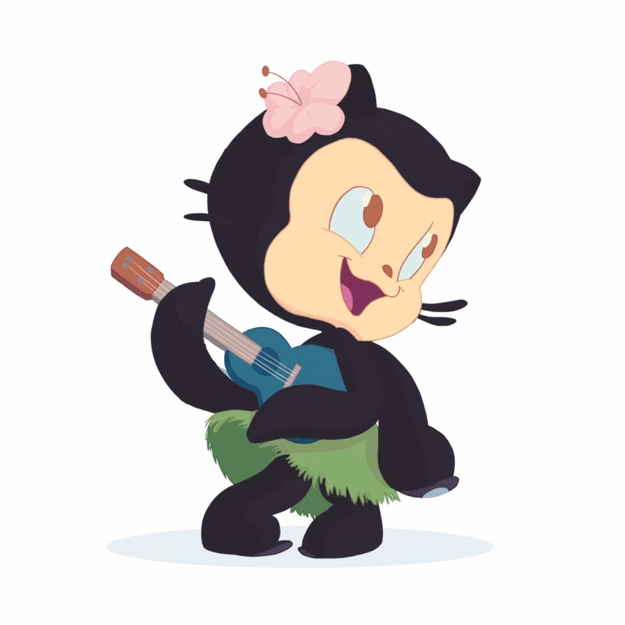

### Hello World! 👏

🦘 🐳 😎 👨🏽‍💻 🎪

  
  
  
  
  

---

## 🎍 My Skills

  <!-- based on your public repos' main languages: HTML / Python / Go / Shell / JavaScript -->
  

---

## ⚡ Tool

  

---

## 🐍 Snake

  

---

## 📊 Stats

  <table>
    <tr>
      <td align="center" valign="middle">
        
      </td>
      <td align="center" valign="middle" width="180">
        
         
        
      </td>
    </tr>
  </table>

